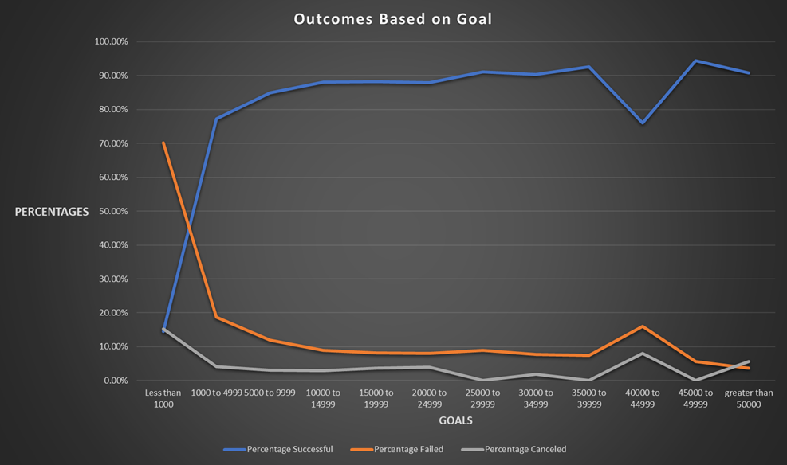
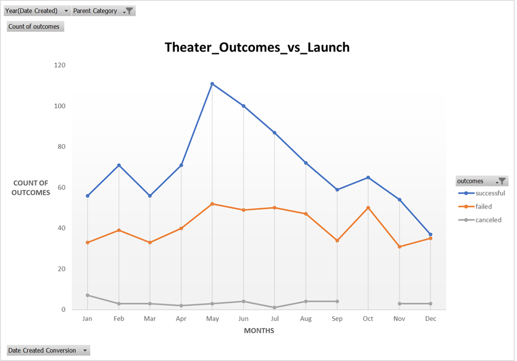

# **Kickstarter-Analysis**

## **Overview**

In this assignment we will be analyzing accumulated data that glances at crowd-funded projects aiming to move onto production once they've reached their goal, this data is not limited to just one region and category. We will be dissecting the data in a variety of ways from successful projects reaching their goals to failures, which country and category received greater outcome, budget estimates after crunching numbers into more digestible and tangible data tables/charts, etc. However, we will narrow our focus on two main aspects: "Theater Outcomes by Launch Date" and "Outcomes Based on Goals."

## **Outcomes Based on Goals**
We'll start off with Outcomes based on Goals to provide us small insight on trends and funding patterns for project big and small associated with it. If we look to the table it may be overwhelmiong at first but on closer inspection we can see the success rates seems to stay over 75% on various goal ranges with the exception being "Less than 1000." Furthermore, the graph displays clearly that projects are more likely to succeed and more funding when they set larger goals while taking into consideration that cancellation occurs at a low constant percentage regardless of the goal.

|Goals|	Number Successful|Number Failed|Number Canceled|Total Projects|	Percentage Successful|Percentage Failed|Percentage Canceled|
|:----:|:---------------:|:-----------:|:-------------:|:------------:|:--------------------:|:---------------:|:-----------------:|
|Less than 1000|	248|	1202|	262|	1712|	14.49%|	70.21%|	15.30%|
|1000 to 4999|	907|	219|	48|	1174|	77.26%|	18.65%|	4.09%|
|40000 to 44999|	19|	4|	2|	25|	76.00%|	16.00%|	8.00%|
|5000 to 9999|	383|	54|	14|	451|	84.92%|	11.97%|	3.10%|
|25000 to 29999|	51|	5|	0|	56|	91.07%|	8.93%|	0.00%|
|10000 to 14999|	178|	18|	6|	202|	88.12%|	8.91%|	2.97%|
|15000 to 19999|	97|	9|	4|	110|	88.18%|	8.18%|	3.64%|
|20000 to 24999|	66|	6|	3|	75|	88.00%|	8.00%|	4.00%|
|30000 to 34999|	47|	4|	1|	52|	90.38%|	7.69%|	1.92%|
|35000 to 39999|	25|	2|	0|	27|	92.59%|	7.41%|	0.00%|
|45000 to 49999|	17|	1|	0|	18|	94.44%|	5.56%|	0.00%|
|greater than 50000|	147|	6|	9|	162|	90.74%|	3.70%|	5.56%|

## **Theater Outcomes by Launch Date**
Let it be known this is a small representation of the over all data as there are many more categories, thier data and trends vary but still display distinguishable patterns over a period of time.

